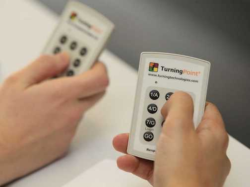

layout: true

.footer[These slides available at <http://bit.ly/oten-plickers>]

<!--
Ever wanted to add classroom response systems (clickers) to your courses but don’t want to deal with all the headaches and cost? Plickers is a free and excellent alternative!

I’ll describe how I have used Plickers in my SOC 301 class at Pacific and my MATH 141 course at Reed to check for student understanding and to facilitate just-in-time teaching. My purpose is to show faculty/teachers that for reasonably sized classes (15-60) classroom response systems are a great way to break up a lecture, test for understanding after an activity, spark discussions among students on a topic, or just engage students in an enjoyable way for the instructor and for the students. I’ll discuss how I go about creating multiple-choice questions for use with the Plickers, what has gone well, and what I’d like to improve on going forward.

I will demonstrate that the power of Plickers is really in their simplicity. Students hold up a piece of paper with their response (A, B, C, or D) to a multiple-choice question. The instructor then opens the free Plickers app and scans the room for responses. As the instructor scans the room, the app automatically detects student responses and the instructor is able to look immediately at the distribution of responses and how each student has voted. This requires no Internet connection, nothing to download for the students, and no devices to carry around before, during, and after class. Further, I’ll provide an opportunity to demonstrate the Plickers with those in attendance, show them how to use the Plickers smartphone app, and how to create their own questions. I’m hoping that those in attendance, regardless of discipline will have new ideas in how they could Plickers in their courses.
-->

---

# Why are classroom response systems useful for student learning?
--

---

# Why are classroom response systems useful for student learning?
--

---

# So what about clickers?

---

# Sounds good, but...

---

# Ugh...

---

# Why Plickers?

---

# Is it really free?

--

### Aside from printing the cards, ABSOLUTELY, YES!  It's completely free.

--

---

# But how do you get the student responses?

---

class: center, middle

DEMO

## http://plickers.com

---

# Writing good multiple choice questions

---

# Some tips
--

- Have students write their own multiple choice questions for practice

    - Students can try out other student questions
    - Crowdsourcing for the win!
--

- Keep data on incorrect responses you have seen in the past
--

- Use *None of the above* &nbsp; & &nbsp; *Two of the above are true*   as options

---

# Resources

- [Plickers Help](https://plickers.zendesk.com/hc/en-us)

- [Plickers 101: Plickers Made Easy Webinar (YouTube)](https://www.youtube.com/watch?v=KcMbP8ENxOI)

- [Plickers - A Step by Step Tutorial (YouTube)](https://www.youtube.com/watch?v=Qpx56rjCVjQ)

- [My blogpost on Plickers](http://blogs.reed.edu/ed-tech/2016/03/plickers-an-excellent-alternative-to-clickers/)

- [Eric Mazur discussing the power of just-in-time teaching (YouTube)](https://www.youtube.com/watch?v=Z9orbxoRofI)

---

# Thanks!

- Slides created via the R package [<small>`xaringan`</small>](https://github.com/yihui/xaringan) by Yihui Xie.

- Email me at <chester@pacificu.edu>

- Follow me on Twitter @old_man_chester

- Source code for these slides is on [GitHub](https://github.com/ismayc/oten-plickers) 

